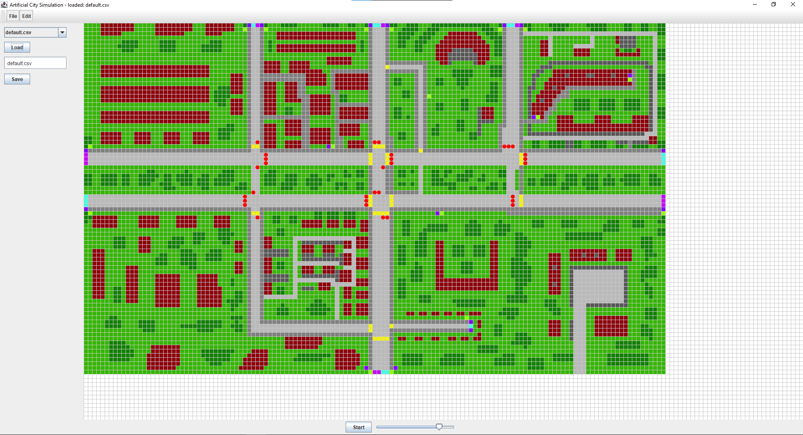
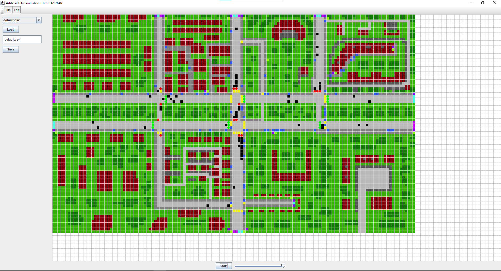

artificial-city
===============

Tematem naszego projektu "Artificial City" jest symulacja ruchu drogowego w warunkach miejskich. Naszym celem było stworzenie automatu komórkowego, który wiernie oddawałby realia poruszania się w ośrodku miejskim. Taki program mógbły pomóc w zaprojektowaniu bezpiecznych
dróg i skrzyżowań w miastach w całej Polsce.

Nasz model uwzględnia nie tylko użytkowników aut jako uczestników ruchu drogowego, ale także
i pieszych. Obecność pieszych i skrzyżowań narzuciło nam dodanie zupełnie nowych elementów
których nie ma w prostszych modelach takie jak przejścia dla pieszych albo sygnalizacja świetlna.

Poruszanie się pojazdów
------
Pojady poruszają się według modelu Nagel-Schreckenberg https://en.wikipedia.org/wiki/Nagel%E2%80%93Schreckenberg_model

Sygnalizacja Świetlna
---
Dla uproszczenia pomijamy pomarańczowe światło, gdy światło jest zielone, samochody mogą ruszać, gdy jest czerwone, oczywiście powinniśmy się zatrzymać. Każde światła kontrolują konkretne komórki na drodze, które puszczają samochody lub nie. Skrzyżowanie jest sterowane kontrolerem, do którego można wprowadzić dowolną konfigurację w jaki sposób i po jakim czasie będą zmieniać się kolory świateł

Skręcanie Pojazdów
---
Każda z przejezdnych pól jest opisana przez macierz reprezentującą szansę na skręt w danym
kierunku przez auto przyjeżdżające z danego kierunku.

Przykładowa symulacja ruchu na Nowym Kleparzu:
---
